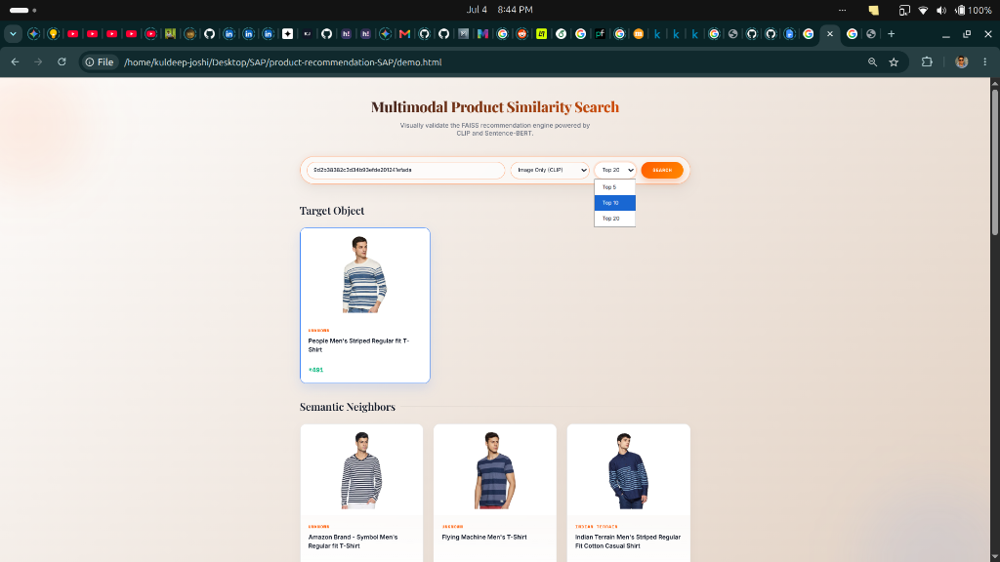
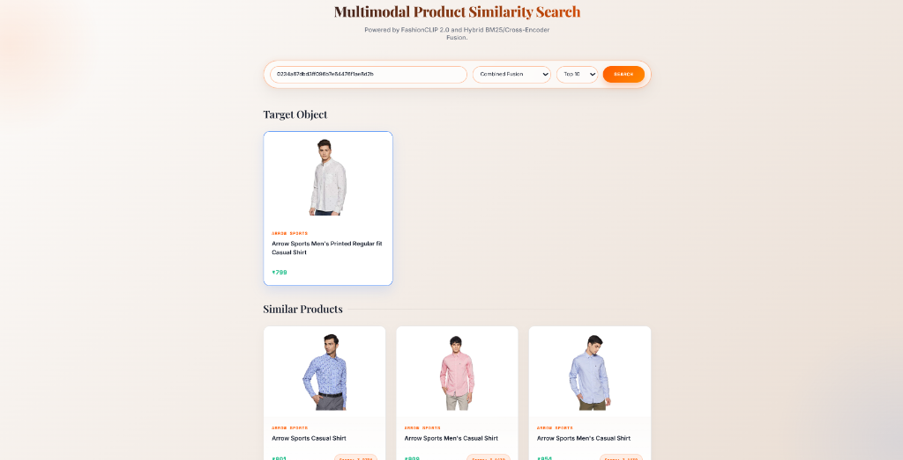
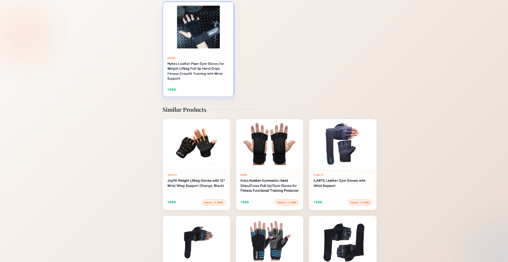
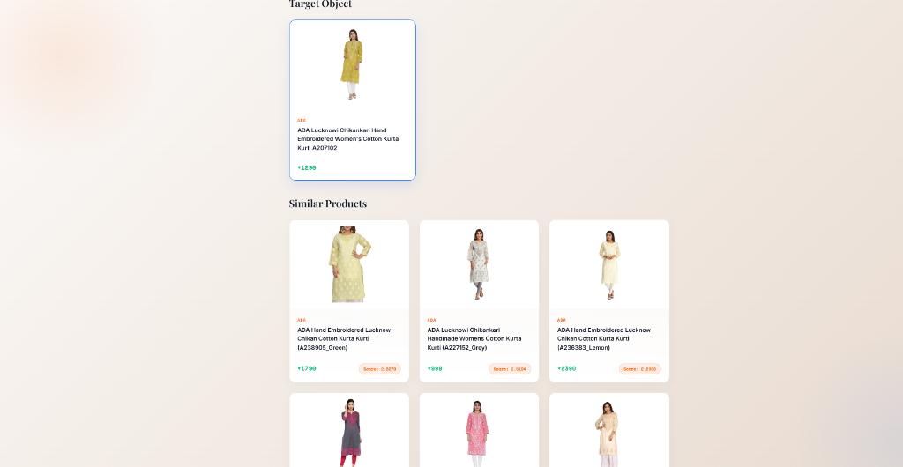

# Multimodal Fashion Search Engine

A production-grade **Multimodal Product Search Engine** for fashion e-commerce. It combines Dense Semantic Retrieval (FAISS HNSW), Sparse Keyword Matching (BM25), FashionCLIP Visual Embeddings, and Cross-Encoder Re-ranking to deliver highly relevant product recommendations across text, image, and hybrid search modes.

---

## 1. Features

- **Text Search** — Type a natural language query (e.g., "red summer dress") and retrieve semantically similar products.
- **Image Search** — Upload a product photo and find visually similar items using FashionCLIP.
- **Hybrid Retrieval** — Fuses BM25 keyword matching with dense vector search via Reciprocal Rank Fusion (RRF).
- **Cross-Encoder Re-ranking** — Stage-2 re-ranker scores the top candidates with full cross-attention for maximum accuracy.
- **Sub-10ms Latency** — FAISS HNSW graphs provide $O(\log N)$ approximate nearest neighbor search.

---

## 2. How to Run

### Step 1: Environment Setup
```bash
python3 -m venv .venv
source .venv/bin/activate
pip install -r requirements.txt
```

### Step 2: Build the FAISS Indices (One-Time)
```bash
python build_index.py
```
This builds the BM25 sparse index, runs Sentence-BERT and FashionCLIP neural embeddings, and constructs the FAISS HNSW graphs. Takes ~1-3 minutes depending on hardware. Generates an `indices/` directory.

### Step 3: Start the API Server
```bash
uvicorn app:app --host 0.0.0.0 --port 8000
```

### Step 4: Search
**Text search:**
```bash
curl -X POST http://localhost:8000/search/text \
  -H "Content-Type: application/json" \
  -d '{"query": "red summer dress", "top_k": 5}'
```

**Image search:**
```bash
curl -X POST http://localhost:8000/search/image \
  -F "file=@photo.jpg" -F "top_k=5"
```

**Product ID lookup (legacy):**
```
GET /find_similar_products?product_id=xxx&num_similar=10&mode=text_structured
```

---

## 3. API Endpoints

| Endpoint | Method | Description |
| :--- | :--- | :--- |
| `/search/text` | POST | Search by natural language text query |
| `/search/image` | POST | Search by uploading an image |
| `/find_similar_products` | GET | Find similar products by product ID |
| `/find_similar_products_detailed` | GET | Same as above, with full metadata |
| `/product/{product_id}` | GET | Retrieve metadata for a single product |
| `/health` | GET | Health check for K8s probes |
| `/demo` | GET | Local visual demo UI |

---

## 4. Visual Demo UI

With the server running, open **[http://localhost:8000/demo](http://localhost:8000/demo)** for an interactive dashboard.

**Image Search** — Finding similar striped shirts using FashionCLIP visual embeddings:
<br>


**Hybrid Search** — Matching Arrow Sports casual shirts via BM25 + Semantic Text:
<br>


**Hybrid Search** — Finding relevant Gym Gloves by fusing Text, Structured Metadata, and Images:
<br>


**Hybrid Search** — Accurately matching ethnic wear (ADA Kurtis) despite complex vocabulary:
<br>


---

## 5. Architecture & Configurable Parameters

All system parameters are centralized in `config.py` and tunable via environment variables.

| Environment Variable | Default | Description |
| :--- | :--- | :--- |
| `HNSW_M` | `32` | Bidirectional links per FAISS graph node |
| `HNSW_EF_CONSTRUCTION` | `200` | Candidate list size during graph build |
| `HNSW_EF_SEARCH` | `64` | Candidate list size during query |
| `TEXT_MODEL_NAME` | `sentence-transformers/all-MiniLM-L6-v2` | Dense text embedding model (384-dim) |
| `IMAGE_MODEL_NAME` | `patrickjohncyh/fashion-clip` | Visual embedding model (512-dim) |
| `TOP_N_BRANDS` | `100` | Top brands for one-hot encoding |
| `TOP_N_COLORS` | `30` | Top colors for one-hot encoding |
| `TEXT_STRUCT_WEIGHT` | `0.4` | Late-fusion weight for text/structured vectors |
| `IMAGE_WEIGHT` | `0.6` | Late-fusion weight for image vectors |
| `RERANKER_TOP_K` | `15` | Candidates sent to Cross-Encoder for re-ranking |
| `LRU_CACHE_SIZE` | `1024` | LRU cache size for repeated queries |

---

## 6. Benchmarks

| Mode | Vector Dims | p50 Latency | p95 Latency | Recall@10 |
| :--- | :--- | :--- | :--- | :--- |
| Image Only | 512 | 0.224 ms | 0.335 ms | 98.80% |
| Text & Structured | 524 | 0.231 ms | 0.627 ms | 99.40% |
| Combined | 1,036 | 0.368 ms | 0.575 ms | 99.00% |

---

## 7. Design & Architecture
See **[DESIGN.md](DESIGN.md)** for a deep dive into engineering decisions, performance trade-offs, and deployment strategies.
